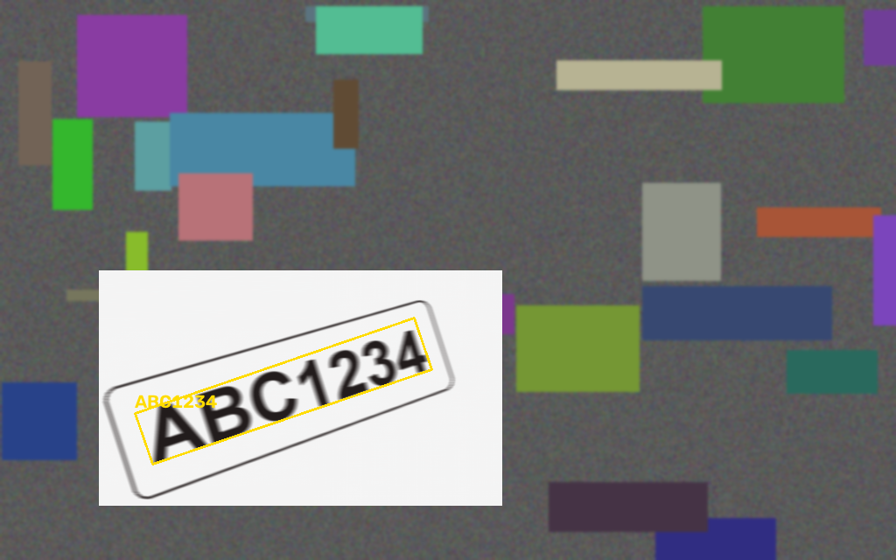
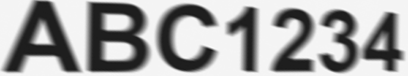

# plateread

Reads a license plate out of a photograph that is steeply tilted, shot from an
angle, sideways, motion-blurred, badly lit or small — and tells you honestly
when the pixels no longer contain the answer.

Where the image alone cannot settle a character, it falls back on real-world
evidence: the plate grammars jurisdictions actually issue, and optionally a
vehicle source you supply.

```bash
plateread read photo.jpg
```

```
[1] HKW8462
    confidence ##################...... 75.7%
    agreement  ###################..... 79.5%  (21 independent reads)
    image      ######################## 100.0%  [GOOD]
    detail     char height ~73px, stroke ~9.3px, dynamic range 222/255
               motion blur ~8px @ 7 deg
    per character:
      1. H   100.0%
      2. K   100.0%
      3. W   100.0%   [confusable with M]
      4. 8   100.0%   [confusable with B]
      ...
```

A plate rotated 18°, shot at an angle, motion-blurred, and buried in clutter —
found and unwarped:




## The one thing to know first

**Nothing here invents detail.** Skew, rotation, perspective, uneven lighting
and mild blur are *invertible* — the information is still in the pixels, just
rearranged, and undoing the transform genuinely recovers it. Resolution loss is
not invertible. If a plate is 30 pixels wide, the characters were never sampled
finely enough to tell an 8 from a B, and no amount of upscaling, sharpening or
"AI enhancement" changes that. Tools that appear to do it are generating a
plausible plate, not recovering the real one.

So every read comes with three separate numbers, which mean different things:

| number | question it answers |
|---|---|
| **image** | Did the photograph ever contain enough detail? Measured at native resolution, before any processing. |
| **agreement** | Do independent processing chains reach the same answer? |
| **confidence** | Vote share weighted by how well the glyphs actually matched real letterforms. |

A read can be unanimous and still wrong, so `image` is reported separately and
can veto: below roughly 12px of character height the tool says
**INSUFFICIENT** and tells you the string is a guess.

## How it works

```
photo → detect → rectify → restore ×N → binarize ×M → segment → OCR → vote
```

**Detect** — characters produce a band of vertical gradients packed far tighter
than anything else in a street scene. Closing that band with a ladder of kernel
widths fuses it into a plate-shaped blob. A second, independent detector groups
MSER regions into collinear runs of glyph-sized shapes. Candidates are scored on
edge density, aspect ratio and *rhythm* — the regular peak/valley beat that only
a row of characters produces.

**Rectify** — the highest-value step. The four plate corners are recovered from
its dominant lines and perspective-unwarped to a front-on rectangle, then the
tilt is removed by finding the angle that makes the text band's row profile
sharpest (searched to ±46°, so a plate lying almost diagonally still comes back
level), then residual slant by finding the shear that makes the gaps between
characters deepest. If nothing readable turns up, the whole image is retried at
each quarter turn, which covers a photo taken in the other orientation.

Candidates are judged *after* straightening, not before. A plate tilted 35° fills
barely half its axis-aligned bounding box, so scoring it on that box measures the
background as much as the plate — that one bug was the difference between 0/4 and
5/5 on steeply tilted plates.

**Descreen** — a photograph *of a screen* carries the display's pixel grid
beating against the sensor, and that texture sits at exactly the frequency and
scale the gradient detector keys on, so it has to come off before detection or
the plate is never found. The pattern shows up as isolated spikes in the
spectrum and is notched out. This is subtractive: it removes an interference
pattern that was added, rather than inventing detail.

Deciding up front whether an image needs it does not work — every measure tried
(peak prominence, peak count) put heavy motion blur and sensor noise in the same
range as real moire. So instead the tool reads the image normally and only
retries descreened if that first read did not settle, which costs nothing on an
image that read fine and needs no threshold. Force it either way with
`--descreen on|off`.

**Restore** — CLAHE, illumination flattening and unsharp masking always; Wiener
and Richardson–Lucy deconvolution when blur is detected. Motion blur length and
direction are read off the cepstrum: a linear blur multiplies the spectrum by a
sinc whose periodic nulls appear as a pair of spikes at ±L along the direction
of travel.

That estimate is reliable on mild blur and increasingly not so as blur grows —
which is exactly when it matters. So `--aggressive` ignores it and searches: it
deconvolves with a grid of PSFs (six lengths × twelve directions) and keeps the
three whose output most looks like text, judged on histogram separability *and*
on whether the characters came back as separate bodies rather than one smear.
Separability alone is not enough — a smeared band can be beautifully bimodal and
still be illegible.

Deconvolved variants are deliberately down-weighted in the vote, because they
recover real detail *and* manufacture ringing.

**Segment** — connected components reconciled against the column ink-density
profile. Merged characters are split only where the ink genuinely thins, judged
relative to the deepest valley rather than a fixed threshold; shattered glyphs
are rejoined; plate frames are rejected for being taller than the characters or
for filling their bounding box the way no letter does.

**OCR** — a self-contained classifier that renders A–Z and 0–9 from fonts
already on the machine and matches on four features: bitmap cross-correlation,
**zoning density** (ink fraction per cell of a 4×6 grid — the density
fingerprint, which survives blur well), row/column profiles, and topological
hole count. Tesseract is used as a second opinion when installed; it is not
required.

**Vote** — every combination of restoration and binarisation is read
independently and the readings vote position by position. Characters that
survive every variant are solid; characters that flip between variants are
exactly the ones flagged as weak.

## Install

```bash
cd PlateReader
.venv/Scripts/python.exe -m pip install -r requirements.txt
```

The venv is already set up. On Windows use the `plateread.cmd` wrapper; anywhere
else call `python -m plateread`.

Optional extras, both of which add another independent opinion to the vote:

```bash
# the trained sequence model (see 'The trained model' below)
.venv/Scripts/python.exe -m pip install torch --index-url https://download.pytorch.org/whl/cpu
```

and Tesseract, if you install the binary plus `pytesseract`. Everything
works without either.

## Usage

```bash
# basic
plateread read photo.jpg

# a hard image: many more restorations, including deconvolution
plateread read photo.jpg --aggressive

# constrain to a jurisdiction's real plate formats - the biggest single win
plateread read photo.jpg --region us-ca

# or an explicit pattern, if you know it exactly
plateread read photo.jpg --pattern "[A-Z]{3}[0-9]{4}"

# break remaining ties against a vehicle source you are authorised to query
plateread read photo.jpg --verify-cmd "your-lookup {plate}"

# see every stage as PNGs, including the detection overlay
plateread read photo.jpg --debug-dir out/

# show the individual readings behind the vote
plateread read photo.jpg -v

# machine-readable
plateread read photo.jpg --json
```

`--region` and `--pattern` are the most effective flags when you know anything
about the plate's format. `--aggressive` is what to reach for on heavy blur: it
adds the blind PSF search, at a few seconds per image.

### Testing it

Because it generates its own ground truth, you can check the claims:

```bash
# realistic vehicle scenes with known ground truth, then read them back
plateread scenario --out-dir samples --read

# one specific degradation, dialled in by hand
plateread synth --text ABC1234 --rotate 14 --perspective 0.3 --motion 9 --out test.png
plateread read test.png

# the full difficulty ramp
plateread selftest --samples 5
```

### Camera positions

Real plate cameras sit in a handful of standard places, and each produces a
characteristic geometry. `cameras` renders a vehicle as each of them sees it
and reads it back:

```bash
plateread cameras --out-dir cameras --read
plateread cameras --camera pole-cctv --motion 12 --read
```

| preset | yaw | pitch | distance | what it is |
|---|---|---|---|---|
| `gantry` | 6° | 34° | 6.5m | overhead toll / motorway gantry |
| `pole-cctv` | 32° | 24° | 11m | street pole, above and to one side |
| `parking-entry` | 41° | 14° | 3.2m | car park entry, wide lens |
| `barrier` | 52° | 27° | 2.6m | barrier arm, very close and oblique |
| `roadside` | 34° | 9° | 14m | roadside speed camera |
| `dashcam` | 7° | 4° | 9m | following the car ahead |

These use a real pinhole projection — the scene is treated as a plane in 3D,
rotated by yaw, pitch and roll and projected through a camera with a given
focal length — rather than the single-axis trapezoid `synth --perspective`
applies. That distinction matters: a pole camera applies pitch *and* yaw at
once, producing foreshortening in both axes simultaneously, which a trapezoid
cannot express and the rectifier therefore never gets tested against. The wide
lenses also get barrel distortion, because entry and barrier cameras all have
it.

Motion blur direction follows the geometry rather than defaulting to
horizontal: a vehicle travels along the road, and for an angled camera the road
does not project to a horizontal line.

`scenario` renders a plate onto a plausible vehicle rear — tail lights, badge,
tailgate seam, bumper, background clutter — because those are the distractors a
real photo has and a bare plate on a grey field is not a fair test. Current
results:

| scenario | truth | read | outcome |
|---|---|---|---|
| angled-street | BNK7315 | BNK7315 | correct |
| truck-screen | TXR4821 | TXR4821 | correct |
| truck-screen-hard | TXR4821 | TXR4821 | correct |
| cctv-small | VWB2740 | VWD274O | **refused** (insufficient) |
| cctv-tiny | VWB2740 | IMI | **refused** (insufficient) |
| eu-defocus | KH5299 | WXXXXX | **refused** (insufficient) |

3/6 exact, and every one of the three failures is reported as INSUFFICIENT
rather than offered as an answer. That is the intended behaviour: on these
images the right output is a refusal, not a plausible-looking string.

Measured on the built-in ramp (5 samples per level, template engine alone, no
Tesseract):

| level | without model | with model |
|---|---|---|
| clean | 5/5 | 5/5 |
| rotated 12° | 5/5 | 5/5 |
| angled view | 2/5 | 3/5 |
| angled + rotated | 4/5 | 5/5 |
| soft focus | 5/5 | 5/5 |
| motion blur | 3/5 | 5/5 |
| motion + angle | 3/5 | 4/5 |
| small (0.35x) | 5/5 | 5/5 |
| small + noisy | 5/5 | 5/5 |
| photo of a screen | 1/5 | 4/5 |
| screen + blur | 1/5 | 4/5 |
| heavy defocus (sigma 3) | 5/5 | 5/5 |
| severe motion (18px) | 3/5 | 2/5 |
| extreme tilt 35 deg | 4/5 | 5/5 |
| extreme tilt -42 deg | 4/5 | 5/5 |
| tilt + motion | 5/5 | 5/5 |
| the hard one | 5/5 | 5/5 |
| **beyond recovery** | **2/5** | **3/5** |
| **total** | **67/90 (78% chars)** | **80/90 (94% chars)** |

**Do not read that as a 13-plate improvement in plate reading.** The tell is the
last row: `beyond recovery` is a level built to be unreadable — a plate shrunk
to 13%, blurred, noised and JPEG-crushed — and the model reads three of five at
91% character accuracy. A model that can read plates deliberately constructed to
be unreadable has not learned to read plates; it has learned to invert this
repository's degradation chain, which is the same chain the ramp uses.

The scenario set is the more honest comparison, because it is drawn by a
different code path: 3/6 → 4/6 there. Real photographs would be a fairer test
still, and that number does not exist yet.

Levels are five samples each, so individual rows move by one between runs.

Note on reproducibility: `add_noise` used an unseeded generator until this was
caught by a camera sweep whose first column disagreed with an identical earlier
run — 4/6 against 6/6, purely from the dice. It is seeded now, so a benchmark
that moves between runs has actually changed. Numbers recorded before that fix
carried that jitter, which is worth remembering when comparing them.

Before this round of work the same ramp scored 0/4 on both extreme-tilt levels
and 0/4 on severe motion; the tilt fix (scoring candidates after straightening,
and searching rotation to ±46°) and the blind PSF search are what moved them.

The two screen levels are the current worst cases and are deliberately harsh —
a 40% amplitude pixel grid at a 3px period. Sweeping the strength shows where
the boundary actually sits:

| moire amplitude | exact | chars |
|---|---|---|
| 0.00 | 4/4 | 100% |
| 0.10 | 4/4 | 100% |
| 0.20 | 4/4 | 100% |
| 0.30 | 1/4 | 32% |
| 0.40 | 1/4 | 46% |

So light-to-moderate screen patterning is handled; heavy patterning at a period
close to the stroke width is not, because by then the grid and the glyph
strokes occupy the same frequencies and removing one removes the other.

The last row is the important one. It is in the ramp to confirm the tool reports
low confidence and refuses to vouch for the string, rather than producing a
clean-looking plate that happens to be fiction.

## Aiming at images people cannot read

This is the intended use, and it splits into two bands that need keeping apart.

**Where a machine genuinely beats a person.** Geometry nobody can mentally
unwarp, blur that is mathematically invertible, contrast below what the eye
resolves, noise that averages out across many independent processing chains.
The tool runs dozens of restorations and binarisations per image and votes; no
one does that by eye. Measured on the resolution axis, it reads plates at about
**10px character height** — roughly half what a person needs — and gets 75% of
them exactly right there.

**Where nothing wins.** Once blur has merged neighbouring glyphs into one mass,
or characters fall to a handful of pixels, the answer is not in the file. Every
tool that appears to succeed here is generating a plausible plate, not
recovering the real one.

`plateread limits` measures where each boundary sits:

```bash
plateread limits --axis motion --samples 6
plateread limits --fast            # all axes, quicker
```

It sweeps one degradation at a time and reports four numbers per point: exact
accuracy, character accuracy, how often the tool refused, and — the important
one — **BLUFF**, the rate of wrong plates it did *not* flag.

That last column is what makes reading further into the hard band worth having.
A plain failure is survivable, because the caller knows to distrust it. A
confident wrong plate is not. On the resolution sweep BLUFF stays at 0% all the
way down, including at settings where the tool is refusing every image while
still getting three quarters of them right — reading past its own stated limit
without ever asserting it.

Optimising for hard images therefore means widening the first band while
holding BLUFF at zero, not loosening the gate so something is always returned.
The gate is the reason a read from this band is worth anything.

Measured limits so far, all with BLUFF at 0%:

| axis | operating limit | vs. a person |
|---|---|---|
| resolution | ~10px character height (scale 0.12) | people need 15-20px |
| motion blur, head-on | 20px, about 2x stroke width | people lose it near 1.5x |
| motion blur + camera angle | ~8px, and weak there | the current worst case |
| JPEG quality | did not break at quality 2 | artefacts bite people near 20 |

The compression row is worth reading carefully: a single-axis sweep bottoming
out at 100% has not found a limit, it has run out of sweep. Large high-contrast
characters survive JPEG almost arbitrarily far, so the axis only bites in
combination - and even shrunk to 30% *and* crushed to quality 2 the tool stays
at 80%. Compression is not the enemy; resolution and blur are, and single-axis
testing would have hidden that.

Measured so far: **0 bluffs** on the whole resolution sweep, down to and past
the point where the tool refuses every image, and **0** on the angled-camera
plus motion-blur band where it only reads 2/6. It fails there, but it says so
every time.

BLUFF is measured against `trustworthy`, not the quality verdict alone —
quality only asks whether the pixels were sufficient, while `trustworthy` also
requires the processing chains to have agreed, and it is what drives the
reassuring banner a caller actually sees. An earlier version of this metric
checked the weaker condition and therefore under-reported bluffing.

### A negative result worth keeping

The obvious way to push into the hard band is to train the model on harder
data. Tried: rotation widened to ±15°, shear to ±0.35, perspective to 0.30,
motion blur to 26px, 6000 steps.

It was **worse on exactly the band it targeted** — 0/6 against the baseline's
2/6 at 8px of blur on angled cameras — and it bluffed more often. Training
destabilised as well, with loss climbing from 0.14 at step 2000 to 0.48 by step
6000. Past a point, widening augmentation stops making the model tougher and
starts making the task unlearnable, so the model settles for a blurry average
that fits nothing.

The augmentation ranges are back where they were. The lesson generalises: on
this pipeline, gains in the hard band have come from fixing *ordering* and
*measurement* bugs — deblurring before detection rather than after, scoring
candidates after straightening rather than before — not from asking the network
to absorb more distortion.

## Choosing between competing readings

When the image alone cannot settle a character, two kinds of outside evidence
can.

### Plate grammars (offline, on by default)

A plate is not a free string. Every jurisdiction issues a small number of fixed
shapes, and that structure resolves most of what OCR cannot: if position 5 must
be a digit, a glyph scored as "S" is a 5, not an S.

```bash
plateread list-formats                     # what it knows
plateread read photo.jpg --region us-ca    # constrain to one jurisdiction
plateread read photo.jpg --region uk
plateread read photo.jpg --formats examples/formats_example.json
plateread read photo.jpg --no-formats      # raw reading, no grammar
```

Formats are masks — `L` letter, `D` digit, `A` either — because a mask says what
each *position* must be, which is what makes position-aware correction possible.
The grammar is applied to the per-position distributions, not to the winning
string, so where the top choice is the wrong class the runner-up is usually the
right character outright and gets picked up instead of blindly substituted.

Any correction is printed (`grammar corrected OSG8S47 -> OSG8547`), never
silent.

**Narrow it with `--region` if you possibly can.** With all regions enabled the
table is permissive enough that almost any string satisfies *something* — in
testing, `OSG8S47` matched the Brazilian mask exactly and so was left alone,
where `--region us-ny` correctly forced position 5 to a digit. The built-in
table is representative, not authoritative: series change, and every
jurisdiction issues vanity, government and trade plates these masks will not
match. Supply your own with `--formats` when you know the local series.

### Vehicle lookup (needs a source you supply)

If two readings survive, the strongest remaining evidence is outside the plate:
one of them belongs to a vehicle that exists and the other does not.

```bash
plateread read photo.jpg --verify-cmd "python examples/lookup_stub.py {plate}"
```

plateread runs your command once per candidate reading, expects a JSON object
back, and reranks: a reading that resolves to a real vehicle beats one that
resolves to nothing. It also reads the **car's own colour** out of the
photograph — sampling bodywork above the plate, not the plate or the road — and
checks it against the colour the source reports, which needs no database at all.

```
    verifying 4 candidate reading(s) against the supplied source
    vehicle in the photo looks silver
      OSG8347    2019 Silver Honda Civic   [colour matches the photo]
      OSG8S47    no record
      OSG8S4T    no record
    verification favours OSG8347 over the image-only reading OSG8547
```

That is a real example: the image-only reading was wrong, the true plate sat
third in the beam at 7%, and the lookup pulled it to the top.

**No lookup service is bundled, and this deliberately does not embed one.**
There is no free public plate-to-vehicle database:

- **United States** — motor vehicle records are restricted by the Driver's
  Privacy Protection Act (18 U.S.C. § 2721). Commercial resellers exist but
  require you to attest to a permissible use.
- **United Kingdom** — the DVLA Vehicle Enquiry Service returns make, colour and
  tax/MOT status (no keeper details) through an API key you register for.
- **Elsewhere** — varies, and is usually restricted.

So it is a plug, not a product: point it at your own fleet database, a parking
system, or an official API you hold a key for. `examples/lookup_stub.py` is a
working template. The command runs without a shell and the plate is restricted
to A–Z0–9, so there is nothing to escape.

## The trained model

The template engine has to be handed one glyph at a time, so it inherits every
segmentation mistake. When blur merges two characters there is nothing it can
do — that is exactly the failure documented in Limits below. A CTC sequence
model reads the whole strip and never commits to character boundaries at all,
which is the one approach that can get past it.

```bash
# train on synthetic data (no dataset needed - it is generated)
plateread train --steps 4000

# then use it: picked up automatically from models/crnn.pt
plateread read photo.jpg --aggressive
plateread read photo.jpg --no-model      # compare without it
```

Training run that produced the shipped checkpoint: 5000 steps, batch 48, about
31 minutes on a CPU, reaching **94.1% exact / 98.3% characters** on synthetic
validation. Read the next section before believing that number.

On the scenario set — which is drawn by a *different* generator path — the model
takes the ensemble from 3/6 to 4/6, and the case it fixes is `cctv-small`, the
small-plate surveillance still that the segmenting engine could only get to
within one character of.

**Architecture** — a small CRNN: five conv blocks (32→256 channels) collapse a
48×160 greyscale strip to a 40-step sequence, a 2-layer bidirectional GRU reads
it, and a CTC head emits per-column character probabilities. 1.6M parameters,
trains on a CPU in minutes, and runs fast enough to sit inside an ensemble that
already does a lot of work per image.

It does not replace the other engines. It joins the vote, because they fail
differently: the template matcher struggles on unusual fonts, the model on
anything far from its training distribution, and a disagreement between them is
information. `--no-model` turns it off.

### Feeding it your own images

Synthetic data alone produces a model that is excellent at reading synthetic
data. The augmentation is deliberately harsher than reality to narrow the gap,
but only real labelled examples close it.

```bash
# 1. cut candidate plate crops out of a folder of photos
plateread labels my_photos/ --out-dir crops

# 2. keep the crops that are really plates, delete the rest, and label them:
#    rename each file after its plate (ABC1234.png), or write a labels.csv
#    with 'filename,PLATE' rows

# 3. train with them mixed in - they also become the validation set
plateread train --real-dir crops --steps 6000
```

Real crops are mixed into every batch at `--real-ratio` (35% by default) and a
fifth of them is held out for validation. That held-out number is the only one
worth quoting: validation on synthetic data measures how well the model learned
the generator, not how it will do on your photographs, and the trainer says so
when that is all it has.

### Why the headline numbers are not trustworthy yet

The model trains on plates drawn by `dataset.PlateSynth`. The self-test ramp
draws its plates with `synth.make_sample`. Those are different code paths, but
they are the same *idea* — PIL text rendered with the machine's fonts, degraded
with the same family of OpenCV operations — so a model trained on one has seen
the other's distribution in all but detail.

That makes any self-test improvement partly circular. It is not a measurement
of reading plates; it is a measurement of reading plates *that this repository
draws*. Real photographs differ in ways the generator does not model: genuine
plate typefaces rather than Arial, embossing and its shadows, dirt, frames,
reflections, and sensor noise that is not Gaussian.

Treat the synthetic numbers as a check that training worked, nothing more. The
only number that means anything is validation on held-out real crops, which is
why `--real-dir` exists and why the trainer refuses to let a synthetic-only
score pass without saying so.

### What the model does not change

It is still bound by resolution. A CNN cannot read an 8px character either —
and unlike the template matcher, a trained model will produce a fluent,
confident, *plausible* plate from noise, because that is what it was trained to
emit. That is the failure mode behind every "AI enhanced" plate demo.

So the model is a voter, not an authority. The image-quality gate still runs
ahead of it and still vetoes: if there is no row of character-shaped regions at
native resolution, the read is reported as INSUFFICIENT no matter how sure the
network is.

## Reading the output

- **`<-- weak`** on a character — the variants disagreed there. Check the
  alternate readings.
- **`[confusable with ...]`** — that glyph pair is hard to separate in degraded
  images regardless of confidence. `--pattern` resolves most of these.
- **other readings** — the runner-up whole-plate strings with their
  probabilities. On a marginal image, treat this as the real answer: a short
  list, not one string.
- **"Ink reaches the edge of the plate crop"** — a leading or trailing character
  may be missing entirely. The tool cannot see what was cropped away, so a
  unanimous read can still be incomplete.

## Limits

- Single-line Latin plates. Stacked/two-line formats are not segmented as such.
- Severe motion blur (~18px, comparable to the gaps between characters) is the
  weakest case at 2/5 exact — at that point neighbouring glyphs physically merge
  and deconvolution only partly separates them again.
- No automatic jurisdiction detection: the grammar has to be told the region, or
  it uses the whole permissive table.
- Heavy screen moire (amplitude above ~0.3 at a period near the stroke width) is
  not recoverable — the pattern and the glyph strokes share frequencies.
- Heavy defocus that merges neighbouring characters is not recoverable either.
  Once blur has filled the gaps between glyphs, no deconvolution setting in the
  sweep brings them back, and a segment-then-classify pipeline has nothing to
  segment. A human can still often read such a plate; this tool cannot, and
  says so rather than guessing.
- The built-in format table is representative, not authoritative, and matches no
  specialist series.
- Character templates come from system fonts, not real plate typefaces. Supply a
  closer face with `--font path/to/font.ttf` for a meaningful accuracy gain on a
  known plate style.
- Below ~12px character height it will tell you it cannot do this. Believe it.
